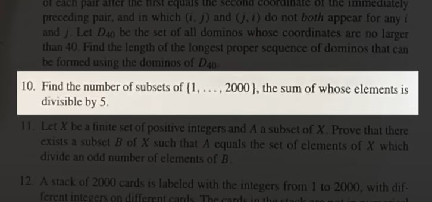

# Subsets With Sum

**Book**: 102 Combinatorial Problems - *Titu Andreescu and Zuming Feng*

**Question**:

```
Find the number of subsets of {1, ..., 2000}, the sum of whose elements is divisible by 5.
```

---

*Picture from the book:*



## Brute Force - Solution

*This is just an example of how to not find the answer for the previous question. Would take forever...*

```bash

~.../repo/app$ python main.py

>> Enter the lowest number of the set: 0
>> Enter the highest number of the set: 15
>> Enter the divisor (!= 0): 5

[DEBUG] Counting the number of subsets that are divisible by 5.
[DEBUG] The set of numbers is {0, 1, 2, 3, 4, 5, 6, 7, 8, 9, 10, 11, 12, 13, 14, 15}.
[DEBUG] Counting divisible subsets: 100%|███████████████████████████| 65535/65535 [00:11<00:00, 5729.81it/s, Divisible subsets=13119]
>> There are 13119 subsets divisible by 5.
```
